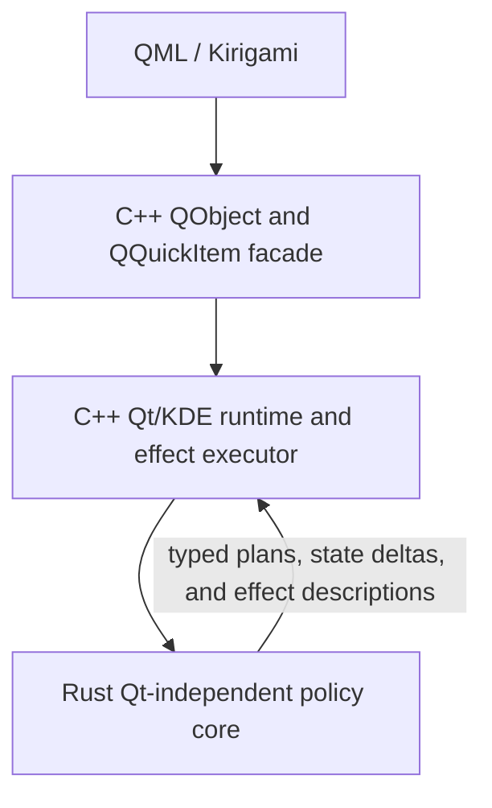
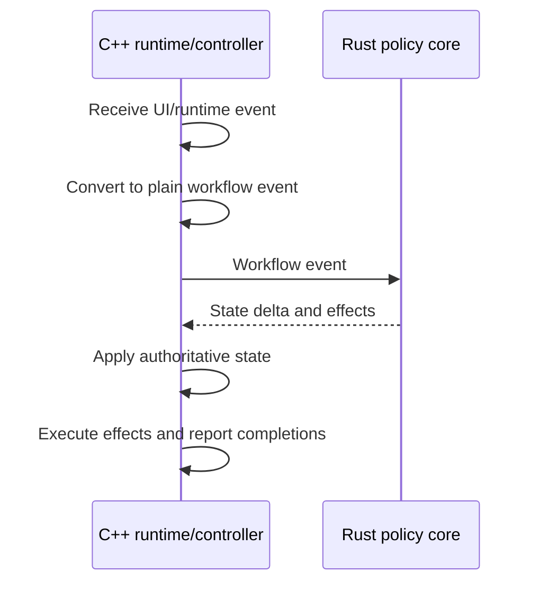

# Architecture

This document records the long-term architecture direction for KiriView. It is not a product behavior specification; user-visible behavior belongs in the files under `../spec/`.

KiriView is a KDE Kirigami image viewer built from three cooperating layers:

The main maintenance goal is to keep product policy testable without making Rust own Qt runtime concerns. Rust should decide what should happen. C++ should know how to make it happen in Qt and KDE.

## Layer Ownership

QML and Kirigami own declarative UI composition:

- Page structure, menus, toolbars, overlays, and shortcut attachment points.
- Visual placement of action objects supplied by the C++ facade.
- Bindings to documented QObject properties and invokable methods.
- UI-only state that does not affect application behavior.

C++ QObject and QQuickItem facade classes own the public QML surface:

- `Q_OBJECT`, `Q_PROPERTY`, `Q_INVOKABLE`, signals, and QML registration.
- Conversion between QML-friendly types and internal controller APIs.
- Thin forwarding to controllers and render items.

C++ Qt/KDE runtime code owns platform integration and side effects:

- `QObject` lifetime, signal delivery, thread affinity, and cancellation.
- `QUrl`, `QImage`, `QAction`, `QQuickItem`, `QSGRenderNode`, and other Qt objects.
- `QAction` identity, KDE action collections, configured shortcut state, and shortcut persistence.
- KIO jobs, KDE settings, dialogs, notifications, file operations, and runtime integration.
- Image presentation, rendering, and async job orchestration.
- View-owned render context discovery, such as device pixel ratio and maximum texture size. A document may consume one render context provider, but page render items must not compete to install independent providers for the same document.

Rust owns Qt-independent policy and algorithms:

- State transitions, workflow plans, and reducer-like decisions.
- Zoom, viewport, tile, spread, navigation, deletion-target, follow-up, and cache decisions when they are computed from plain value snapshots.
- Parsing and byte-level format inspection that is independent of Qt objects.
- Pure calculations where the same input should produce the same output.

## Language Boundary

The Rust/C++ boundary should be a policy boundary, not a mechanical split by feature name. A module belongs in Rust when its inputs and outputs can be expressed as plain values and it does not need to know about Qt object lifetime or side effects.

Prefer Rust for logic that:

- Can be represented as `State + Event -> StateDelta + Effects`.
- Is reused by multiple controllers or presentation paths.
- Is complex enough that Rust unit tests materially improve confidence.
- Would make a C++ controller hard to read if left inline.
- Avoids direct dependency on `QObject`, `QImage`, `QUrl`, KIO, or rendering APIs.

Prefer C++ for logic that:

- Is mostly `QObject`, Qt property, signal, or QML API plumbing.
- Depends on `QImage`, `QUrl`, `QAction`, `KIO::Job`, `QQuickItem`, or `QSGRenderNode`.
- Exists to manage async lifetime, cancellation, ownership, or thread affinity.
- Immediately executes Qt/KDE side effects.
- Is only a small local branch whose Rust bridge would be larger than the
  policy itself.

Rust should not call back into Qt/KDE adapters directly. It should return typed plans, state deltas, or effect descriptions. C++ should execute those effects and feed completion events back into the workflow.

## State Ownership

For QObject-facing workflows, C++ owns the authoritative runtime state. This includes QML-facing properties, Qt notification ordering, `QUrl`, `QImage`, `QString`, async job lifetime, presentation objects, and rendering objects.

Rust reducers operate on value snapshots and plain events. They return explicit state deltas, transition plans, and effect descriptions. Those results describe what C++ should apply; they are not an independent authoritative copy of the same workflow state.

Rust-owned state is reserved for self-contained Qt-independent domains where the state can be represented as plain values and does not mirror authoritative C++ state. Examples include format parsing state and geometry or zoom algorithms. Navigation indices, cache policy state, or other workflow state may move to Rust only when that ownership is documented in this file or an ADR and exposed through value-based FFI.

Avoid split-brain state. A workflow value must have one canonical owner. If both languages need to observe it, one side owns the value and the other side receives a derived snapshot, projection, delta, or completion event.

### Current Cross-Language Ownership

These defaults apply until this document or an ADR explicitly changes the owner. Moving policy into Rust does not move the authoritative runtime state unless the same decision also names the new state owner.

- Actions and shortcuts: C++ owns action identity, KDE action collections, the canonical configured shortcut list, shortcut persistence, and the active shortcut handling installed in Qt. QML presents and invokes C++ actions. Rust may compute stateless shortcut projections, such as menu-safe representatives or derived viewer aliases, but it must not store shortcut state.
- Document and image loading: C++ owns the current document kind, displayed URL or document page, pending load identity, active jobs, decoded image objects, and user-visible load/error state. Rust may compute transition plans from a snapshot, but it must not keep a second displayed-image or pending-selection state.
- Supported image lists and page position: C++ owns the confirmed supported image list, current index, boundary state, and pending page selection for a runtime scope unless an ADR gives that scope a different owner. Rust navigation policy may return target indices or follow-up effects from those snapshots.
- Zoom, pan, rotation, scan-start handoff, and spread presentation: the active C++ presentation controller or view facade owns the public presentation state exposed to QML. Rust geometry or spread policy may calculate next values from snapshots. If a presentation mode needs its own state owner, the mode transition must still expose exactly one active public owner.
- View render context: `KiriImageView` owns render-context discovery for the attached document only when it is the primary viewport facade. Secondary page views render secondary snapshots but do not install or clear the document render context provider.
- Deletion: Rust policy may choose the deletion target and post-delete follow-up target from plain document/navigation snapshots. C++ owns KDE confirmation, the file operation, cancellation and failure handling, notifications, and applying the follow-up plan.
- Preparation and cache: C++ owns prepared image objects, decoder jobs, memory pressure handling, and cache lifetime. Rust may compute preparation priority or eviction policy from plain metadata, but cached runtime objects remain in C++.

### Derived Public State

QML-facing values may be derived from multiple C++ runtime states. For example, a public loading or status property may combine document state with an active presentation transition. The derived value must not become a second mutable source of truth. Keep the canonical owners explicit, and make notification dependencies follow the derived value.

When a public value has mode-specific ownership, only the active mode owns that value. Inactive mode state is a cache, projection, or restoration point, not a competing owner. Transition code must synchronize the next active owner before exposing the mode change. For example, different presentation modes may use different internal state owners, but the public value must have exactly one active owner at a time.

## FFI Design

FFI code should be intentionally boring. A good bridge is explicit, typed, and easy to audit.

Use small bridge structs and enums for:

- Stable policy inputs.
- State snapshots.
- Change sets.
- Effect plans.

Avoid bridges that expose:

- Raw Qt object ownership.
- Long-lived Rust references to C++ objects.
- Implicit side effects hidden behind policy functions.
- One-off wrappers whose only purpose is to move a local C++ `switch` into
  Rust.

When a Rust module starts to look like glue, either move the branch back to C++ or absorb it into a larger Rust workflow reducer where it becomes part of a coherent policy decision.

## Workflow Shape

The preferred long-term shape for product workflows is event-driven:

For image opening, concrete event names may evolve. The architectural requirement is that request, loading, decoding, failure, presentation, and completion-related events carry enough operation identity for the C++ owner to reject stale results.

Rust can decide loading status, error recovery, navigation updates, cache policy, and follow-up effects. C++ keeps the actual KIO job, decoder job, presentation controller, image object, and render update mechanics.

Async workflow events that can complete out of order must carry enough identity for the owner to ignore stale completions. Workflows that update visible state must distinguish the committed public state from pending targets and publish the new state only after the resources required for that state are ready.

This does not require every existing controller to be rewritten at once. Move logic when a workflow is already being changed and when the new boundary reduces complexity.

## Target Direction

KiriView should evolve toward coherent Rust policy units rather than many small FFI helpers. A Rust module should represent a meaningful workflow or algorithmic domain, such as opening, navigation, deletion, zoom, spread layout, tile selection, parsing, or cache policy.

Small local branches should stay in C++ unless they are part of a larger Qt-independent policy decision. Moving a branch to Rust is useful when it clarifies ownership, strengthens tests, or lets multiple C++ runtime paths share one policy result. It is not useful when the bridge types and conversions become larger than the decision being moved.

The preferred direction is fewer, larger policy boundaries:

- Workflow reducers that accept plain events and return state deltas plus effects.
- Geometry and rendering policy modules that compute values without owning renderer objects.
- Parsing modules that inspect bytes and return plain metadata or decoded domain values.
- Cache prioritization and navigation policies that can be tested without Qt event loops and do not own Qt runtime objects.

C++ should remain the place where those plans are executed through Qt/KDE APIs. This keeps the application adaptable while the pre-release codebase continues to change.

## Testing Strategy

Test Rust policy in Rust unit tests when the logic is independent of Qt. These tests should cover state transitions, edge cases, and policy tables.

Test C++ runtime code with Qt tests when behavior depends on:

- Qt object lifetime or signals.
- `QImage`, `QUrl`, or rendering data.
- KIO or file-operation adapters.
- Controller integration across async boundaries.

Do not duplicate every Rust policy test in C++. C++ tests should verify that the runtime layer applies plans correctly and preserves integration behavior.

## Evolution Rules

When adding or moving logic:

1. Start from ownership: policy in Rust, Qt/KDE execution in C++.
1. Keep FFI value-based and explicit.
1. Move whole policy decisions, not isolated boolean branches.
1. Keep each workflow value under one canonical owner.
1. Keep QObject/QML API changes contained inside C++ facade classes.
1. Avoid adding compatibility layers for pre-release internal formats unless explicitly requested.
1. Document meaningful architecture decisions here or in an ADR.

## Architecture Decisions

Use `docs/adr/NNNN-title.md` for decisions that are too specific for this overview but important enough to preserve. Keep ADRs short:

- Context
- Decision
- Consequences

Examples of ADR-worthy decisions include changing the Rust/C++ ownership model for image opening, replacing a Qt image path with a Rust decoder path, or moving workflow state ownership across the FFI boundary.

Existing ADRs:

- `docs/adr/0001-single-open-archive-document-session.md`: directly opened archive document sessions are owned by the C++ document runtime, including the archive location, sorted candidate list, and serialized archive image reads.
- `docs/adr/0002-libpng-apng-streaming-decoder.md`: APNG playback is owned by the C++ runtime through APNG-patched libpng so frames can be decoded sequentially instead of materializing the full animation in memory.
- `docs/adr/0003-resvg-svg-rendering.md`: static SVG parsing and rasterization are owned by Rust through resvg, while C++ keeps Qt image objects and tile-source integration.
