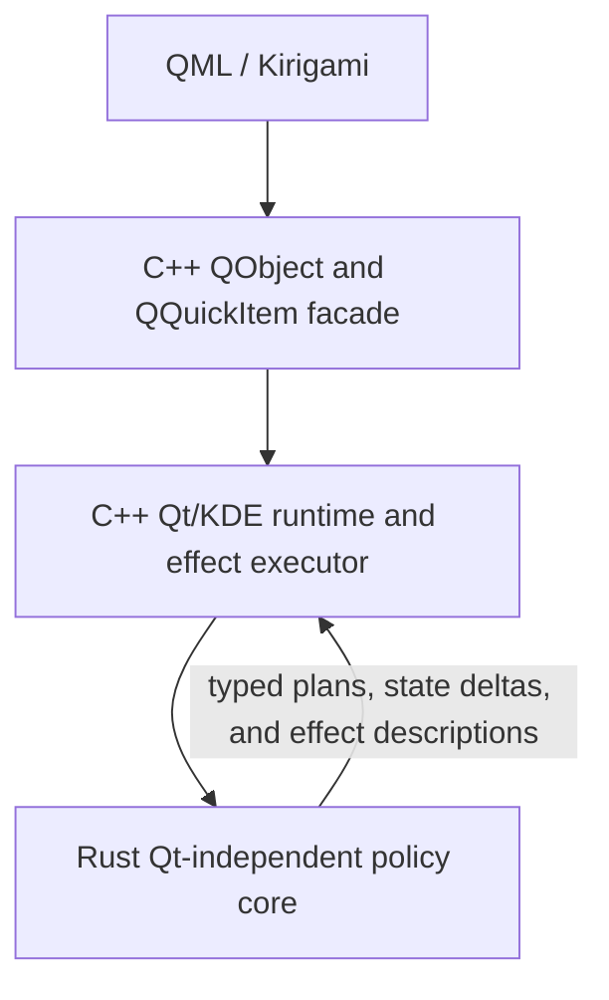
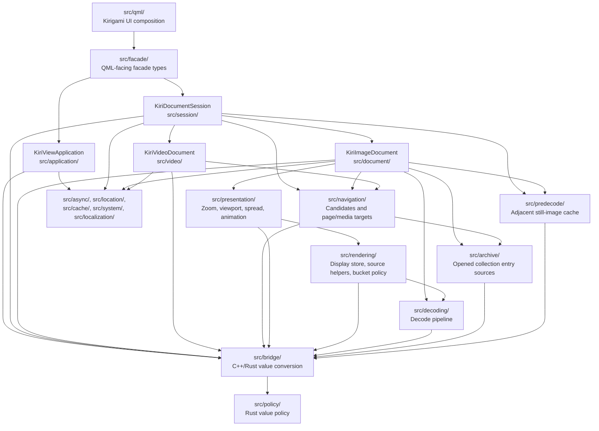

# Architecture Overview

KiriView is a KDE Kirigami image viewer built from three cooperating layers:

The main maintenance goal is to keep product policy testable without making Rust own Qt runtime concerns. Rust defines policy decisions. C++ executes them through Qt and KDE.

The public QML facade layer is grouped in `src/facade/`. Domain runtime code remains in directories such as `src/document/`, `src/presentation/`, `src/rendering/`, `src/navigation/`, and `src/application/`. Shared C++ runtime support with clear ownership, such as localized user-facing text, localization setup, and KDE file-deletion side-effect providers, lives in a named support domain such as `src/localization/` or `src/system/`. C++ helpers that only convert values across the Rust/C++ boundary live in `src/bridge/`; Rust policy bridge files remain under `src/policy/`. The provider-rendering architecture is recorded separately in [Provider Rendering Architecture](provider-rendering.md); `src/rendering/` owns provider display storage, render-context value helpers, display bucket policy, and decoder/refinement helpers, not custom Qt Quick render nodes or QRhi resources.

## Current Source Shape

The current source tree maps the layer model onto a few stable directory groups:

The diagram is directory-level, not a complete call graph. Update it when a long-lived ownership boundary or route owner changes, not for ordinary helper calls.

- `src/qml/` binds to facade types; `src/facade/` is the QML API boundary.
- `KiriDocumentSession` in `src/session/` routes top-level image/video state; image and video document internals remain below `KiriImageDocument` and `KiriVideoDocument`.
- Image work is split by durable domains: lifecycle in `src/document/`, navigation in `src/navigation/`, presentation in `src/presentation/`, rendering in `src/rendering/`, decoding in `src/decoding/`, opened collection media entry access in `src/archive/`, and predecode in `src/predecode/`.
- `src/policy/` is Rust value policy and `src/bridge/` converts boundary values. C++ remains the owner of Qt/KDE objects, side effects, async lifetimes, and authoritative runtime state.

## Source Manifests

Native source manifests under `src/` are the build-validated ownership point for Cargo and development tooling. Add new C++ and Rust sources to the relevant manifest instead of duplicating source lists in build scripts: C++ runtime sources go in `src/cpp_core_sources.txt`, CXX-Qt facade/render sources go in `src/cpp_cxxqt_header_sources.txt` or `src/cpp_cxxqt_sources.txt`, Rust policy sources go in `src/rust_policy_sources.txt`, and CXX-exposed Rust bridge sources also go in `src/rust_bridge_sources.txt`.

Cargo is the canonical compiler for KiriView application native code. The Cargo build owns Rust, production C++ sources from the manifests, CXX-Qt generated code, KConfig generated state code, QML resources, and the resulting app static library. CMake is used for C++ test binaries only: it may compile test-local sources and generated test fixtures, but it consumes Cargo-produced application artifacts instead of rebuilding production app sources.

Development-environment modules that need Qt/CXX-Qt build, runtime, lint, or editor metadata should consume a shared Qt/CXX-Qt tooling context instead of duplicating qmake wrappers, QML import paths, compile-command inputs, generated include refresh logic, or Qt runtime environment snippets in each module.
