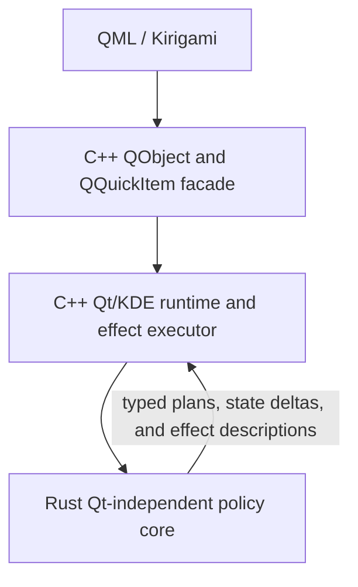

# Architecture Overview

KiriView is a KDE Kirigami image viewer built from three cooperating layers:

The main maintenance goal is to keep product policy testable without making Rust own Qt runtime concerns. Rust defines policy decisions. C++ executes them through Qt and KDE.

The public QML facade layer is grouped in `src/facade/`. Domain runtime code remains in directories such as `src/document/`, `src/presentation/`, `src/rendering/`, `src/navigation/`, and `src/application/`; Rust policy bridge files remain under `src/policy/`.
