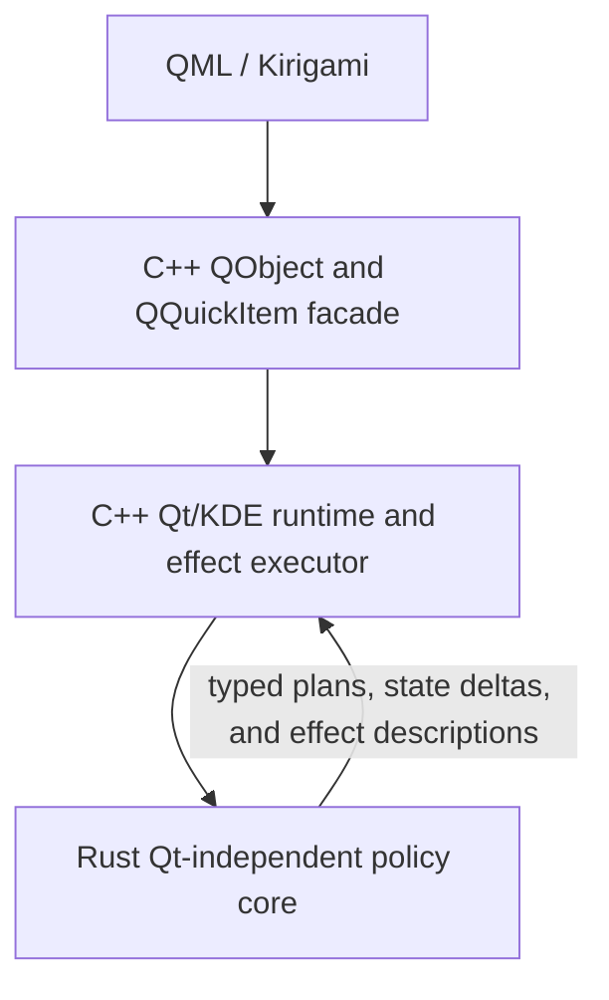

# Architecture Overview

KiriView is a KDE Kirigami image viewer built from three cooperating layers:

The main maintenance goal is to keep product policy testable without making Rust own Qt runtime concerns. Rust defines policy decisions. C++ executes them through Qt and KDE.

The public QML facade layer is grouped in `src/facade/`. Domain runtime code remains in directories such as `src/document/`, `src/presentation/`, `src/rendering/`, `src/navigation/`, and `src/application/`. Shared C++ runtime support with clear ownership, such as localized user-facing text and localization setup, lives in a named support domain such as `src/localization/`. C++ helpers that only convert values across the Rust/C++ boundary live in `src/bridge/`; Rust policy bridge files remain under `src/policy/`.

Native source manifests under `src/` are the canonical repository-level ownership point for Cargo and development tooling source discovery. Keep C++ core runtime sources in `src/cpp_core_sources.txt`, CXX-Qt header and C++ facade/render bridge sources in `src/cpp_cxxqt_header_sources.txt` and `src/cpp_cxxqt_sources.txt`, Rust policy sources in `src/rust_policy_sources.txt`, and Rust bridge sources exposed to CXX-Qt in `src/rust_bridge_sources.txt` instead of duplicating those lists in build scripts. The Cargo build validates C++ source ownership against these manifests so new `src/**/*.cpp` files must be added to exactly one C++ source manifest. It also validates Rust policy ownership so new `src/policy/**/*.rs` files must be listed in the Rust policy manifest, and Rust bridge files must be listed in both the policy manifest and the bridge exposure manifest.
