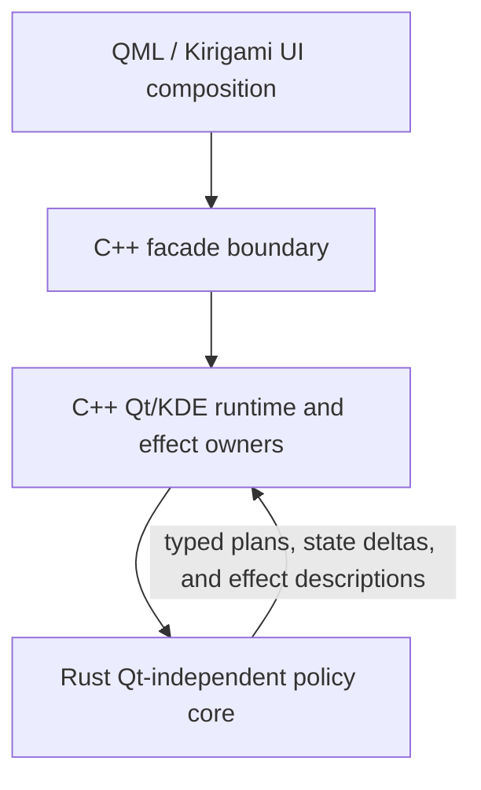
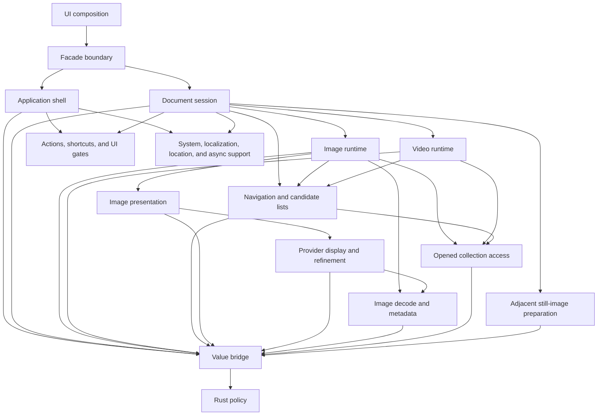

# Architecture Overview

KiriView is a KDE Kirigami image viewer built from cooperating UI, facade, runtime, and policy layers:

The architecture keeps product policy testable without moving Qt object lifetime, KDE side effects, QML rendering objects, or authoritative runtime state into Rust. Rust computes policy from plain values. C++ owns runtime state, executes effects through Qt and KDE, rejects stale completions, and publishes coherent projections to QML.

## Dependency Direction

- QML owns declarative composition and consumes the facade as a placement and interaction surface only.
- The facade owns the QML API boundary, type conversion, and forwarding. It must not own domain workflow state.
- C++ runtime owners own Qt/KDE effects, async lifecycles, projections, and platform integration.
- Rust policy modules consume plain snapshots and return typed plans or values. They must not depend on Qt objects, call KDE adapters, or publish QML-facing state.
- Shared support domains provide explicit capability snapshots or provider ports. Runtime owners consume those ports instead of probing platform state independently.

## Component Ownership Shape

The component graph is a responsibility contract, not a complete call graph:

- The document session owns top-level mixed-media routing, public source identity, active navigation projection, active zoom projection, title subject, displayed-media operation availability, thumbnail-strip projection, and action-availability inputs.
- Image runtime owns image-mode loading, opened collection page state, presentation commands, still-image display resources, animation playback, embedded image metadata, image deletion behavior, and image-specific navigation facts.
- Video runtime owns direct-video resolution, opened-collection video source-device acceptance, playback state, video status, video zoom readout, video metadata where supported, and playback-control readiness.
- Navigation owns candidate ordering, page/media cursor state, boundary facts, live direct-media refresh, and sibling collection discovery. It exposes snapshots and plans rather than public UI state.
- Collection access owns directly opened archive and directory listing, entry-byte access, entry metadata, and eligible collection-video playback devices. It must not update document, video, thumbnail, or QML state directly.
- Provider rendering owns immutable provider display entries, display-source projections, display refinement, render-context capability inputs, and display-store memory pressure. Production image display uses provider-backed whole-image entries, not custom render nodes or visual tile scheduling.
- Decoding owns route-specific image decoding, animation frame enumeration, metadata extraction, and whole-image refinement payloads. Decoder failures preserve typed diagnostics before any user-facing projection is derived.
- Predecode owns still-image-only adjacent preparation. Video rows may be cursor positions for scheduling, but they do not produce video-frame quick-navigation payloads.
- Actions own `QAction` identity, shortcut routing, accepted UI-gate revisions, command dispatch, and unsupported-media shortcut interception. QML reports UI-local gate facts and renders action placements.

## Build and Tooling Ownership

Native source manifests are the build-validated ownership point for production C++ and Rust source membership. Build scripts, linters, and editor tooling must consume those manifests instead of duplicating source inventories or compiler flags.

Cargo is the canonical compiler for production native application code, including Rust, production C++ inputs, CXX-Qt generated code, KConfig generated state code, QML resources, and the resulting app static library. CMake may compile test-local C++ binaries and fixtures, but C++ tests consume Cargo-produced application artifacts instead of rebuilding production sources.

Compile-command metadata follows build ownership. Production compile commands come from observed Cargo/CXX-Qt application builds, and test compile commands come from the test build system. Development-environment tooling may orchestrate refresh, merge, and editor installation, but it must not synthesize hand-authored production or test compile commands.

Development-environment modules that need Qt/CXX-Qt build, runtime, lint, or editor metadata consume a shared Qt/CXX-Qt tooling context instead of duplicating qmake wrappers, QML import paths, compile-command inputs, generated-include refresh logic, or Qt runtime environment snippets.
