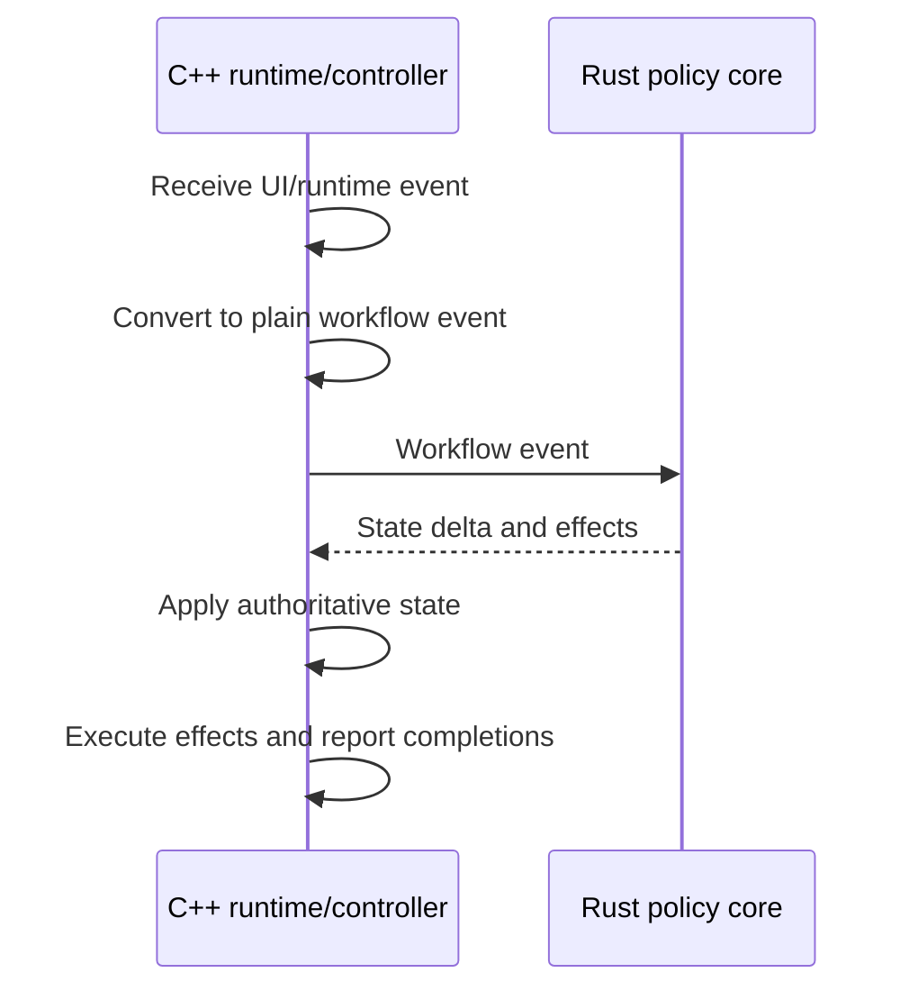

# Workflow Shape

The preferred long-term shape for product workflows is event-driven:

For image opening, concrete event names may evolve. The architectural requirement is that request, loading, decoding, failure, presentation, and completion-related events carry enough operation identity for the C++ owner to reject stale results.

Rust can decide loading status, error recovery, navigation updates, cache policy, and follow-up effects. C++ keeps the actual KIO job, decoder job, presentation controller, image object, and render update mechanics.

Async workflow events that can complete out of order must carry enough identity for the owner to ignore stale completions. Workflows that update visible state must distinguish the committed public state from pending targets and publish the new state only after the resources required for that state are ready.

When multiple C++ policy adapters emit runtime operations for the same workflow, keep the operation contract in a dedicated runtime-plan type instead of letting one producer own the shared operation vocabulary. Effect planners, Rust policy adapters, and controllers may produce or execute those plans, but the plan contract itself should remain the canonical C++ side-effect boundary.

Image-open workflow transitions apply C++-owned document state and return `ImageDocumentRuntimePlan` follow-up operations. Controllers should dispatch those plans directly instead of reporting a second layer of document effects for the same runtime work.

Image-open state deltas own invariant-coupled document facts including source URL, source kind, displayed location, loading, status, error text, container navigation, unsupported opened-collection video, and embedded metadata. Controllers may prepare decoded images and metadata, but publication of those document facts must happen through the transition application plan.

Image-document source-load effects resolve the requested source URL, displayed opened-collection scope, container navigation URL, and directly opened source facts into an opened-collection scope command before crossing into archive source lifetime code. Production filesystem/archive probing belongs to a resolver or adapter boundary that supplies resolved facts; pure image-load planning consumes those facts and must not perform `QFileInfo`, KIO, or other host-environment probes. `MediaEntrySourceStore` owns only media-entry source reuse for an already resolved `OpenedCollectionScopeLocation`; it must not depend on image-document source-load request or image-load planning types.

Direct media routing should evolve toward an explicit document-session plan boundary. A routing plan may classify a requested source as empty, direct video, direct image, or image-document input, but C++ still executes the Qt/KDE side effects by setting `KiriImageDocument`, `KiriVideoDocument`, the session cursor, candidate refresh, and predecode state.

Document-session plans may compute active navigation projections, action-availability gates, direct media routing, deletion fallback, and predecode eligibility from plain snapshots. They must not publish QML-facing values directly, store independent workflow state, or bypass the session-owned stale-completion identity checks.

Shared Previous, Next, First, and Last dispatch belongs to the document session. The C++ action runtime combines the session projection with accepted UI gate snapshots for shared action and shortcut availability; QML reports UI-local gate facts and renders action placements. Route selection and boundary dispatch policy stay behind session methods.

Existing controllers do not need immediate rewrites. Move logic when the workflow is already changing and the new boundary reduces complexity.
