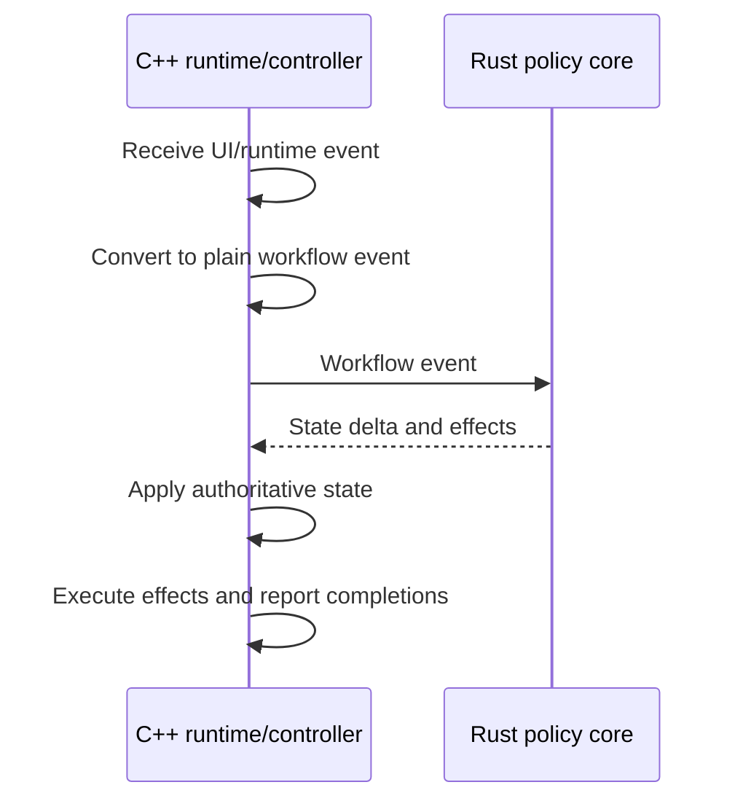

# Workflow Shape

The preferred long-term shape for product workflows is event-driven:

For image opening, concrete event names may evolve. The architectural requirement is that request, loading, decoding, failure, presentation, and completion-related events carry enough operation identity for the C++ owner to reject stale results.

Rust can decide loading status, error recovery, navigation updates, cache policy, and follow-up effects. C++ keeps the actual KIO job, decoder job, presentation controller, image object, and render update mechanics.

Async workflow events that can complete out of order must carry enough identity for the owner to ignore stale completions. Workflows that update visible state must distinguish the committed public state from pending targets and publish the new state only after the resources required for that state are ready.

When multiple C++ policy adapters emit runtime operations for the same workflow, keep the operation contract in a dedicated runtime-plan type instead of letting one producer own the shared operation vocabulary. Effect planners, Rust policy adapters, and controllers may produce plans, but a named workflow owner should bind the operation vocabulary to runtime ports and dispatch the plans.

Image-open workflow transitions apply C++-owned document state and return `ImageDocumentRuntimePlan` follow-up operations. Controllers should dispatch those plans through the image-document runtime workflow owner instead of reporting a second layer of document effects for the same runtime work. The composition root may wire controller ports into that workflow owner, but it must not own the runtime operation table itself.

Predecoded-image lookup is an image-document runtime collaboration, not an implicit sibling-controller dependency. The composition root should bind external direct-media predecode lookup and image-document predecode-controller lookup into one named lookup port, then pass that port to open, spread, or secondary-page loaders that can consume cached provider-ready images. Those consumers should not capture `ImageDocumentPredecodeController` directly just to find cached images.

Primary page-slot publication from the image-open workflow is an open-to-spread interaction that should cross a named port. The composition root may bind that port to the spread presentation controller, but `ImageOpenController` callbacks should not directly capture spread-controller methods just to commit or clear the primary page slot after open transitions.

Page-navigation snapshot reads used by spread presentation are a spread-to-navigation interaction that should cross a named port. The composition root may bind that port to the page-navigation service or another navigation owner, but spread callbacks should not capture the navigation controller just to ask for the current page-navigation snapshot.

Adjacent predecode scheduling requested by spread presentation is a spread-to-predecode workflow interaction that should cross a named port. The composition root may bind that port to runtime-plan dispatch while migration keeps the shared plan vocabulary, but spread callbacks should not construct `ScheduleAdjacentImagePredecodeOperation` directly.

File-deletion in-progress checks used by page-navigation services are navigation-to-deletion interactions that should cross a named port. The composition root may bind that port to the deletion controller, but page-navigation callbacks should not directly capture deletion-controller methods just to gate navigation updates during deletion.

Current page-number reads used by image predecode are navigation-to-predecode interactions that should cross a named port. The composition root may bind that port to the page-navigation service, but predecode callbacks should not directly capture navigation-service methods just to read the current page number.

Animation load errors reported by the page surface are page-surface-to-open workflow interactions that should cross a named port. The composition root may bind that port to the open controller after construction, but page-surface callbacks should not directly capture open-controller methods just to complete an animation load with an error.

Image-document runtime plans may retain one shared operation vocabulary while migration is in progress, but dispatch ownership should split by operation family. Source-load operations are owned by a named source-load runtime plan executor that binds loading-container URL changes, opened-collection preparation, and open-start effects to their ports; the broad runtime plan executor delegates that family instead of directly binding those operations in its visitor. Open-state operations are owned by a named open runtime plan executor that binds open cancellation, displayed-location clearing, presentation clearing, source-url publication, user-facing error publication, and empty-source completion effects to their ports. Predecode operations are owned by a named predecode runtime plan executor that binds clear, cancel, and adjacent-image scheduling effects to their ports. Navigation operations are owned by a named navigation runtime plan executor that binds page-navigation cancellation/update, URL loading, container-image loading/completion, boundary feedback, list-failure reporting, and page-navigation URL loading effects to their ports. Lifecycle operations are owned by a named lifecycle runtime plan executor that binds file-deletion cancellation, presentation-animation shutdown, and spread shutdown effects to their ports. Media-entry source operations are owned by a named media-entry source runtime plan executor that binds media-entry source clearing to its port. Spread operations are owned by a named spread runtime plan executor that binds spread transition completion, reading-direction reset/notification, secondary-page clearing, zoom reset, and failed-container preparation effects to their ports.

Image-open state deltas own invariant-coupled document facts including source URL, source kind, displayed location, loading, status, error text, container navigation, unsupported opened-collection video, and embedded metadata. Controllers may prepare decoded images and metadata, but publication of those document facts must happen through the transition application plan.

Image-document source-load effects resolve the requested source URL, displayed opened-collection scope, container navigation URL, and directly opened source facts into an opened-collection scope command before crossing into archive source lifetime code. Production filesystem/archive probing belongs to a resolver or adapter boundary that supplies resolved facts; pure image-load planning consumes those facts and must not perform `QFileInfo`, KIO, or other host-environment probes. `MediaEntrySourceStore` owns only media-entry source reuse for an already resolved `OpenedCollectionScopeLocation`; it must not depend on image-document source-load request or image-load planning types.

Direct media routing should evolve toward an explicit document-session plan boundary. A routing plan may classify a requested source as empty, direct video, direct image, or image-document input, but C++ still executes the Qt/KDE side effects by setting `KiriImageDocument`, `KiriVideoDocument`, the session cursor, candidate refresh, and predecode state.

Document-session plans may compute active navigation projections, action-availability gates, direct media routing, deletion fallback, and predecode eligibility from plain snapshots. They must not publish QML-facing values directly, store independent workflow state, or bypass the session-owned stale-completion identity checks.

Shared Previous, Next, First, and Last dispatch belongs to the document session. The C++ action runtime combines the session projection with accepted UI gate snapshots for shared action and shortcut availability; QML reports UI-local gate facts and renders action placements. Route selection and boundary dispatch policy stay behind session methods.

Existing controllers do not need immediate rewrites. Move logic when the workflow is already changing and the new boundary reduces complexity.
