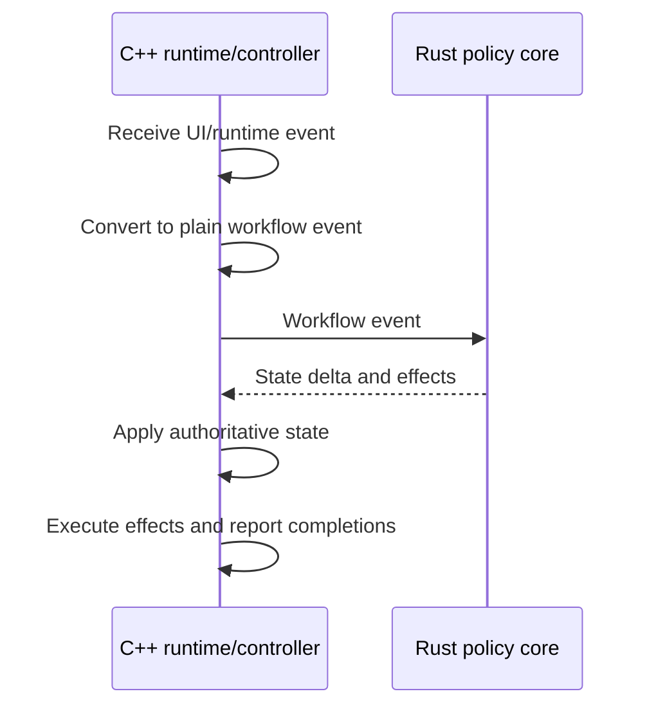

# Workflow Shape

The preferred long-term shape for product workflows is event-driven:

For image opening, concrete event names may evolve. The architectural requirement is that request, loading, decoding, failure, presentation, and completion-related events carry enough operation identity for the C++ owner to reject stale results.

Rust can decide loading status, error recovery, navigation updates, cache policy, and follow-up effects. C++ keeps the actual KIO job, decoder job, presentation controller, image object, and render update mechanics.

Async workflow events that can complete out of order must carry enough identity for the owner to ignore stale completions. Workflows that update visible state must distinguish the committed public state from pending targets and publish the new state only after the resources required for that state are ready.

Existing controllers do not need immediate rewrites. Move logic when the workflow is already changing and the new boundary reduces complexity.
