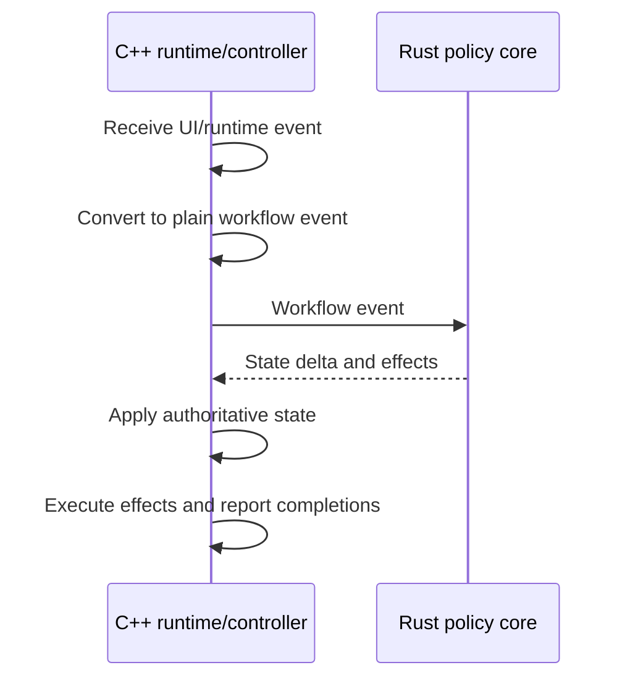

# Workflow Shape

Product workflows are event-driven:

For image opening, concrete event names are implementation-local. The architectural requirement is that request, loading, decoding, failure, presentation, and completion-related events carry enough operation identity for the C++ owner to reject stale results.

Rust policy may compute loading status, error recovery, navigation updates, cache policy, and follow-up effects from plain snapshots. C++ keeps the actual KIO job, decoder job, presentation owner, image object, and render update mechanics.

Async workflow events that can complete out of order must carry enough identity for the owner to ignore stale completions. Workflows that update visible state must distinguish the committed public state from pending targets and publish the new state only after the resources required for that state are ready.

When multiple C++ policy adapters emit runtime operations for the same workflow, the operation contract must live in a dedicated runtime-plan type instead of letting one producer own the shared operation vocabulary. Effect planners, Rust policy adapters, and controllers may produce plans, but a named workflow owner must bind the operation vocabulary to runtime ports and dispatch the plans.

Image-open workflow transitions apply C++-owned document state and return typed follow-up operations. Controllers must dispatch those plans through the image-document runtime workflow owner instead of reporting a second layer of document effects for the same runtime work. The composition root may wire controller ports into that workflow owner, but it must not own the runtime operation table itself.

Cross-controller workflow interactions must cross named ports when they preserve ownership, stale-completion rejection, or public projection ordering. The composition root may bind those ports, but callbacks must not capture sibling controllers just to read state, publish presentation, schedule predecode, gate deletion, or report load errors.

Runtime plans must use a shared operation vocabulary at the workflow boundary and delegate operation families to named owners when that removes duplication or preserves lifecycle ownership. The architectural contract is the typed plan boundary and named dispatch ownership; ordinary helper extraction or executor reshaping does not require an architecture update.

Image-open state deltas own invariant-coupled document facts including source URL, source kind, displayed location, loading, status, error text, container navigation, unsupported opened-collection video, playable opened-collection video handoff, and embedded metadata. Controllers may prepare decoded images and metadata, but publication of those document facts must happen through the transition application plan.

Same-scope image-to-image active navigation is a target-selection workflow, not source replacement. For ordinary direct media scopes and opened collection scopes, selecting a different image row may update the pending navigation target and active-navigation projection before display commit, but it must not clear the committed image presentation, cancel active navigation, or clear provider-ready predecode/cache state solely because the selected image URL changed. Source replacement remains the workflow for top-level source assignment, active scope changes, image-to-video or video-to-image mode changes, empty/error clearing, and container navigation that changes the opened collection scope.

Page navigation owns confirmed candidate snapshots for its active candidate-list source. Opened collection foreground loading and image predecode planning may reuse such a snapshot only when its source matches the requested collection scope; pending refreshes, deletion fallback that changes the retained list, and container navigation that changes scope must invalidate or replace the reusable snapshot before downstream consumers can rely on it. When no fresh confirmed snapshot is available, consumers must fall back to the candidate provider instead of keeping independent candidate-list state.

Image-document source-load effects resolve the requested source URL, displayed opened-collection scope, container navigation URL, and directly opened source facts into an opened-collection scope command before crossing into collection source lifetime code. Production filesystem and archive probing belongs to a resolver or adapter boundary that supplies resolved facts; pure image-load planning consumes those facts and must not perform host-environment probes. The media-entry source store owns only media-entry source reuse for an already resolved opened-collection scope; it must not depend on image-document source-load request or image-load planning types.

Direct media routing uses an explicit document-session plan boundary. A routing plan may classify a requested source as empty, direct video, direct image, archive collection, directory collection, or another image-document input, but C++ still executes the Qt/KDE side effects through image-document, video-document, session-cursor, candidate-refresh, and predecode command ports.

Opened collection video routing is separate from ordinary direct media routing. When the active opened collection selection resolves to an eligible playable video entry, the session keeps the opened collection active-navigation context, asks the media-entry source boundary for a playback source device, and assigns that device to the video document while preserving the collection entry URL as public source identity. Eligible archive entries and directory collection entries may both provide playback source devices; ineligible archive video entries remain in image-mode opened-collection context as unsupported-video placeholders. This path must not synthesize a direct media scope, remount the archive through KIOFuse, or reuse the direct-video playback URL resolver.

Document-session plans may compute active navigation projections, action-availability gates, direct media routing, deletion fallback, and predecode eligibility from plain snapshots. They must not publish QML-facing values directly, store independent workflow state, or bypass the session-owned stale-completion identity checks.

Shared Previous, Next, First, and Last dispatch belongs to the document session. The C++ action runtime combines the session projection with accepted UI gate snapshots for shared action and shortcut availability; QML reports UI-local gate facts and renders action placements. Route selection and boundary dispatch policy stay behind session methods.
